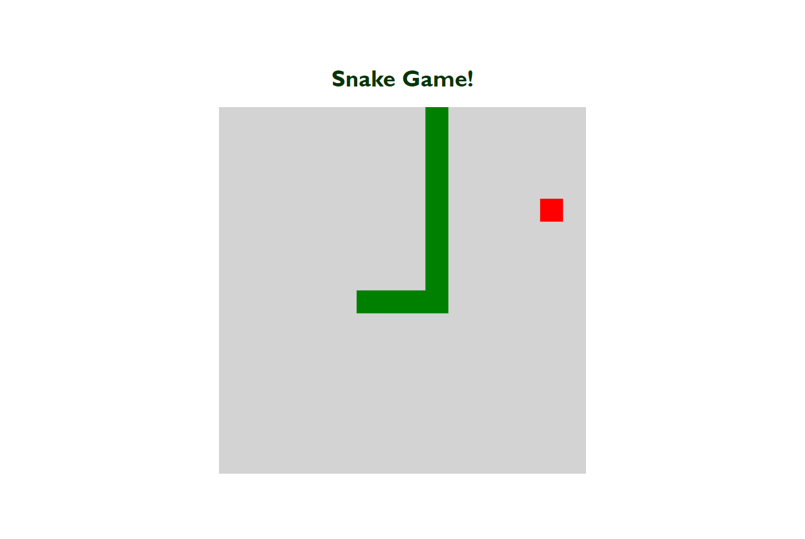

# Projeto jogo da cobrinha

> Plataforma Digital Innovation One

 Projeto realizado durante Bootcamp HTML Web Developer - Recriando o jogo da cobrinha com Javascript, realizado 25/11/21

[ 📎 Clique aqui para acessar] (https://michel-maia.github.io/Projeto-jogo-da-cobrinha/)

 ## Tecnologias 🖥️ 🚀 

- HTML
- CSS
- JavaScript
- Git e GitHub

